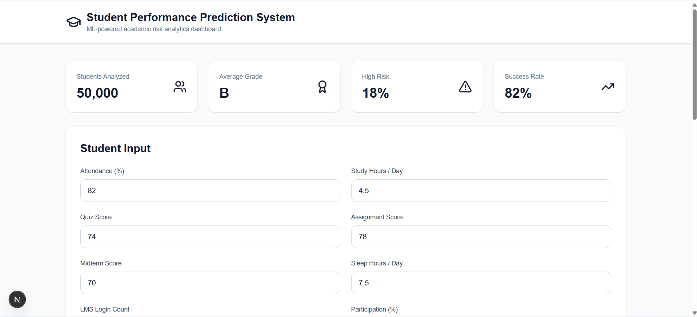
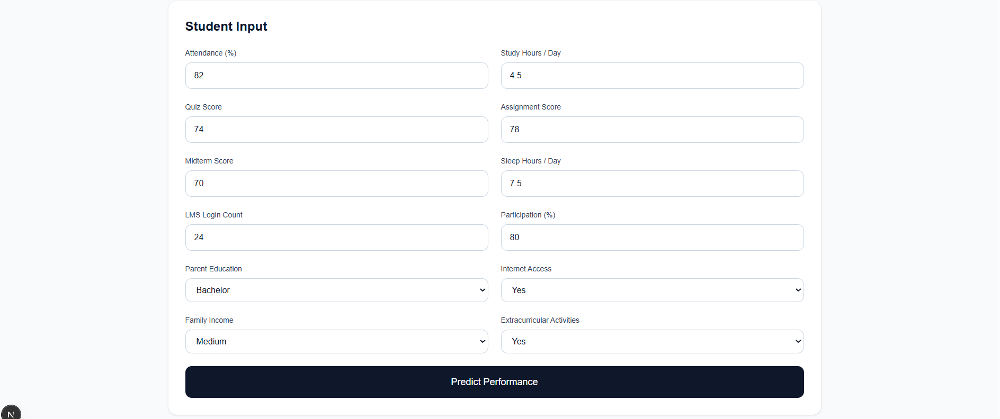
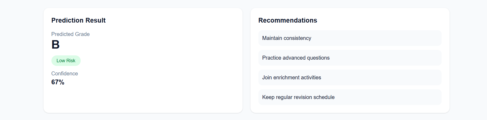
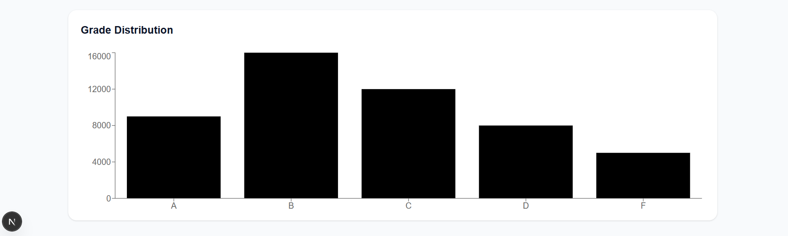

# 🎓 Student Performance Prediction System


An end-to-end **Machine Learning + Analytics Dashboard** project that predicts student academic performance using behavioral, academic, and demographic signals.

This system helps identify **at-risk students early**, enabling proactive academic intervention through data-driven recommendations.

---

## 🚀 Project Overview

Educational institutions and EdTech platforms increasingly use predictive analytics to:

✅ identify academically weak students early  
✅ reduce dropout risk  
✅ personalize learning interventions  
✅ improve student success rate  
✅ optimize academic support systems  

This project simulates that real-world workflow:

Student Data → Feature Engineering → ML Model → Prediction API → Analytics Dashboard

---

## ✨ Key Features

### Machine Learning
- Synthetic academic dataset generation
- Data preprocessing pipeline
- Feature engineering
- Multi-model training
- Best model selection
- Saved model artifacts
- Confidence scoring

### Backend API

Features:
- `/predict` endpoint
- `/health` endpoint
- Swagger docs
- request validation
- recommendation engine
- JSON response

### Frontend Dashboard

Features:
- KPI cards
- student input form
- risk badge
- prediction card
- recommendation panel
- grade distribution chart
- responsive UI

---

## 🏗 Architecture

```text
Student Input
     ↓
Data Cleaning
     ↓
Feature Engineering
     ↓
Model Training
     ↓
Best Model Saved
     ↓
FastAPI Prediction API
     ↓
Next.js Dashboard
     ↓
Risk Alerts + Recommendations
```

---

## 🛠 Tech Stack

### Machine Learning
- Python
- Pandas
- NumPy
- Scikit-learn
- XGBoost
- Joblib

### Backend

- Uvicorn
- Pydantic

### Frontend
- TypeScript
- Tailwind CSS


### Version Control
- Git

---
## 📂 Project Structure

```text
Student-Performance-Prediction/
│
├── api/
│   └── main.py
│
├── dashboard/
│   ├── app/
│   ├── components/
│   ├── lib/
│   └── package.json
│
├── data/
├── models/
├── outputs/
├── src/
├── images/
│
├── requirements.txt
├── README.md
└── .gitignore
```

---

## ⚙️ Installation

Clone repository:

```bash
git clone https://github.com/gaikwadsagar1017/Student-Performance-Prediction-System.git
cd Student-Performance-Prediction-System
```

Install backend dependencies:

```bash
pip install -r requirements.txt
```

Install frontend dependencies:

```bash
cd dashboard
npm install
cd ..
```

---

## ▶️ Run Project

### Start Backend

```bash
uvicorn api.main:app --reload
```

Backend URL:

```text
http://127.0.0.1:8000
```

Swagger Docs:

```text
http://127.0.0.1:8000/docs
```

---

### Start Frontend

```bash
cd dashboard
npm run dev
```

Frontend URL:

```text
http://localhost:3000
```

---

## 📸 Screenshots

- Dashboard 
- Student input form 
- Prediction result card and Recommendation panel 
- Grade distribution chart 
- 
```


## API Example

### POST `/predict`

Request:

```json
{
  "attendance": 82,
  "study_hours": 4.5,
  "quiz_score": 74,
  "assignment_score": 78,
  "midterm_score": 70,
  "sleep_hours": 7.5,
  "lms_login_count": 24,
  "participation": 80,
  "parent_education": "Bachelor",
  "internet_access": "Yes",
  "family_income": "Medium",
  "extracurricular": "Yes"
}
```

Response:

```json
{
  "predicted_grade": "B",
  "risk_level": "Low",
  "confidence": 0.91,
  "recommendation": [
    "Maintain consistency",
    "Practice advanced questions",
    "Join enrichment activities",
    "Keep regular revision schedule"
  ]
}
```

---

## Future Improvements

- deploy model to cloud
- prediction history
- authentication
- student profiles
- intervention tracking
- explainable AI (SHAP)
- real educational dataset integration

---

## Author

**Sagar Sanjay Gaikwad**

M.Sc. Computer Science  
Aspiring Data Scientist / ML Engineer / Web Developer

Connect on :
https://github.com/gaikwadsagar1017

---

